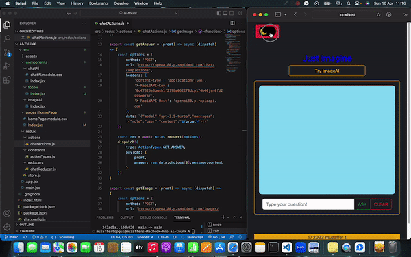

Hallooojjjj

an open ai project with redux thunk middleware
    - created with react vite
    - redux thunk was integreated for managing async actions types
    - user can ask questions and fetch pictures
    - search by various language options
    - darke and ligt theme mode

\{^_^}/  enjoy screen gif \{^_^}/ 

